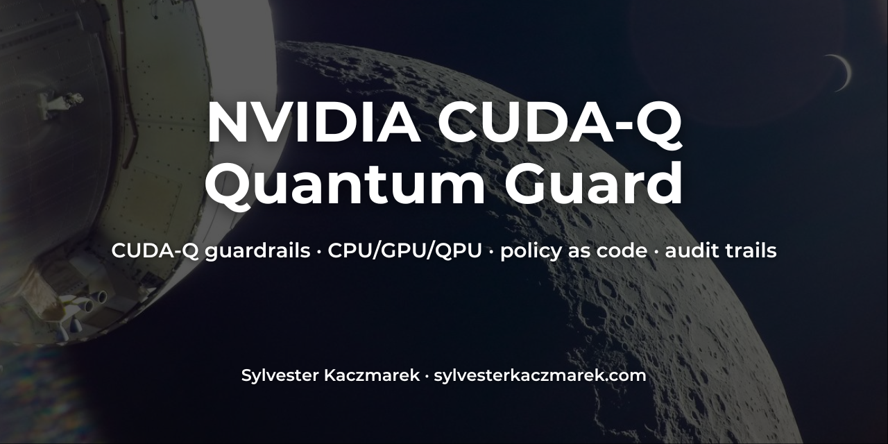
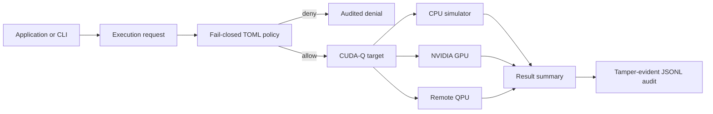

# NVIDIA CUDA-Q Quantum Guard



[](https://github.com/sylvesterkaczmarek/nvidia-cudaq-quantum-guard/actions/workflows/ci.yml)


[](https://doi.org/10.5281/zenodo.17502919)

Policy-controlled execution, diagnostics, backend comparison, and tamper-evident audit trails for NVIDIA CUDA-Q. The `cudaq-guard` CLI is intended for researchers and engineers who want explicit controls around CPU, NVIDIA GPU, multi-QPU, and remote-QPU execution rather than scattering target and safety checks throughout application code.

This is independent open-source software. It is not an NVIDIA product and is not affiliated with or endorsed by NVIDIA.

## At a glance



CUDA-Q already provides a unified programming model across CPUs, GPUs, and QPUs. This repository focuses on a different layer: **how an application decides what quantum work is allowed to run, where it is allowed to run, and what evidence is retained afterwards.**

## Why this is useful

A backend switch that is convenient in a research notebook can become risky in shared infrastructure. A typo, stale configuration, or unreviewed target option can change cost, data handling, resource use, or the system that receives a job.

NVIDIA CUDA-Q Quantum Guard adds a small policy-as-code layer for CUDA-Q:

- allowlist `sample`, `observe`, or other execution operations
- allowlist specific CUDA-Q targets
- distinguish local simulator targets from remote or hardware targets
- bound qubits, shots, QPU IDs, asynchronous execution, and target options
- preflight built-in kernels with CUDA-Q resource estimation before execution
- require deterministic simulator seeds where appropriate
- audit both allowed and denied requests
- chain audit records with SHA-256 so later modification is detectable
- diagnose installed CUDA-Q targets, CUDA-Q GPU visibility, and NVIDIA driver visibility
- compare the same guarded workload across CPU and GPU targets

## What changed from the original prototype

The original repository used a one-qubit Qiskit Aer demonstration and described CUDA-Q as a future backend. Version `0.4.0` reverses that architecture:

- CUDA-Q is now the native quantum runtime
- Qiskit is no longer required
- unknown policies and target options fail closed
- remote execution requires explicit authorization
- simulator randomness can be seeded
- results are called what they are: samples or expectation values, not "quantum confidence"
- the old post-hoc probability "noise" calculation is removed
- policy and execution logic are packaged and tested instead of living in one demo script
- audit records are tamper-evident rather than plain `print()` output

## Install

The policy, audit, and static validation tools have no mandatory third-party dependencies:

```bash
git clone https://github.com/sylvesterkaczmarek/nvidia-cudaq-quantum-guard.git
cd nvidia-cudaq-quantum-guard
python -m venv .venv
source .venv/bin/activate
python -m pip install -e ".[dev]"
```

Install CUDA-Q support as well:

```bash
python -m pip install -e ".[cudaq,dev]"
```

CUDA-Q itself is distributed by NVIDIA as the `cudaq` Python package. GPU acceleration requires a supported NVIDIA GPU/runtime; CUDA-Q can also run CPU simulation without a GPU.

## First commands

Diagnose the machine and list CUDA-Q targets:

```bash
cudaq-guard doctor
cudaq-guard targets
```

Run a guarded GHZ workload on the CPU simulator:

```bash
cudaq-guard run ghz \
  --policy policies/local-safe.toml \
  --target qpp-cpu \
  --qubits 4 \
  --shots 1000 \
  --seed 7
```

Verify the resulting audit chain:

```bash
cudaq-guard audit verify runs/audit.jsonl
```

On a Linux host with a supported NVIDIA GPU, use the same workload and policy with the GPU target:

```bash
cudaq-guard run ghz --policy policies/local-safe.toml --target nvidia --qubits 20 --shots 1000 --seed 7
```

Compare targets without changing the workload:

```bash
cudaq-guard compare --policy policies/local-safe.toml --targets qpp-cpu,nvidia --qubits 20 --shots 1000 --seed 7
```

## Policy example

`policies/local-safe.toml` permits bounded local simulation but blocks remote hardware:

```toml
version = 1
name = "local-safe"
allowed_operations = ["sample", "observe"]
allowed_targets = ["qpp-cpu", "nvidia"]
allow_remote = false
allow_async = false
max_qubits = 28
max_shots = 100000
allowed_qpu_ids = [0]
require_seed = true

[target_options.nvidia]
option = ["mqpu", "fp64"]
```

Unknown policy fields, unsupported policy versions, unlisted targets, and unlisted target-option values are rejected rather than silently defaulted.

See [docs/policy-reference.md](docs/policy-reference.md).

## Library integration

The guard can wrap application-owned CUDA-Q kernels rather than only the built-in CLI examples:

```python
from cudaq_guard import ExecutionRequest, Guard, GuardPolicy
from cudaq_guard.runtime import CudaQRuntime

runtime = CudaQRuntime()
policy = GuardPolicy.from_toml("policies/local-safe.toml")
guard = Guard(policy, audit_path="runs/audit.jsonl", runtime=runtime)

request = ExecutionRequest(
    workload="my-kernel",
    operation="sample",
    target="qpp-cpu",
    qubits=5,
    shots=1000,
    seed=7,
)

result = guard.execute(
    request,
    lambda rt: rt.sample(my_cudaq_kernel, shots=1000),
)
```

A complete example is in [`examples/library_integration.py`](examples/library_integration.py). The example also supplies a `resource_probe`, so CUDA-Q's compiled resource estimate is checked against the declared and policy qubit limits before the kernel executes.

## Built-in workloads

### GHZ sampling

Useful for validating installation, target selection, finite-shot execution, audit behavior, and CPU/GPU comparison.

### Deuteron VQE grid

A two-qubit deuteron workload exercises CUDA-Q `observe` and the classical-quantum loop without adding an optimizer dependency:

```bash
cudaq-guard run vqe --policy policies/local-safe.toml --target qpp-cpu --steps 25 --seed 7
```

The Hamiltonian uses rounded coefficients of the finite-basis N=2 nuclear model in [Dumitrescu et al., *Cloud Quantum Computing of an Atomic Nucleus*](https://arxiv.org/abs/1801.03897). Energies are in MeV. The output identifies the model as `deuteron-n2`; `best_energy` is the lowest evaluated grid point, with no claim of optimizer convergence or an extrapolated physical binding energy. The previous H2 label was incorrect: this is not a molecular-hydrogen model.

The CLI remains `run vqe`, and `h2_vqe_problem` remains available as a compatibility alias for `deuteron_vqe_problem`. New audit requests use the corrected workload name `deuteron-vqe-grid`. See [the equations and numerical checks](docs/reproducibility.md).

## Remote and asynchronous execution

CUDA-Q supports asynchronous submission to multi-QPU simulators and hardware providers. The guard exposes the asynchronous flag to policy so a deployment can explicitly decide whether that mode is allowed.

For example, `policies/remote-explicit.toml` permits only named remote targets and asynchronous execution. Provider accounts, credentials, costs, and device-specific options remain the user's responsibility.

Credential-like target options are redacted from local audit records. Do not place provider secrets directly in policy files.

## Tamper-evident audit

Every record contains the hash of the preceding record and its own canonical SHA-256 hash:

```text
genesis -> record 1 -> record 2 -> record 3 -> ...
```

This detects local record modification or deletion within the observed chain. It is deliberately described as **tamper-evident**, not tamper-proof: a party able to rewrite the whole file can recompute hashes. Sign or externally anchor audit heads when stronger provenance is required.

See [docs/audit-format.md](docs/audit-format.md).

## Security model

The project provides execution controls around calls that go through the guard. It is **not** a Python sandbox and cannot stop arbitrary application code from importing CUDA-Q and bypassing the guard.

For higher-assurance deployments, enforce the guard at a process/service boundary and restrict direct provider/runtime access. See [docs/security-model.md](docs/security-model.md).

## CUDA-Q compatibility

The implementation targets the current CUDA-Q Python API used for:

- `cudaq.get_targets()` / `cudaq.get_target()`
- `cudaq.set_target()`
- `cudaq.sample()` and `cudaq.sample_async()`
- `cudaq.observe()`
- `cudaq.set_random_seed()`
- `qpp-cpu` CPU simulation
- `nvidia` GPU simulation, including policy-controlled target options such as `mqpu`

Primary documentation:

- [CUDA-Q quick start](https://nvidia.github.io/cuda-quantum/latest/using/quick_start.html)
- [CUDA-Q execution](https://nvidia.github.io/cuda-quantum/latest/using/examples/executing_kernels.html)
- [CUDA-Q simulators](https://nvidia.github.io/cuda-quantum/latest/using/simulators.html)
- [CUDA-Q hardware providers](https://nvidia.github.io/cuda-quantum/latest/using/backends/hardware.html)

## Repository layout

```text
nvidia-cudaq-quantum-guard/
├── .github/workflows/ci.yml
├── docs/
│   ├── audit-format.md
│   ├── policy-reference.md
│   ├── reproducibility.md
│   └── security-model.md
├── examples/
│   └── library_integration.py
├── policies/
│   ├── local-safe.toml
│   └── remote-explicit.toml
├── src/cudaq_guard/
│   ├── audit.py
│   ├── cli.py
│   ├── doctor.py
│   ├── guard.py
│   ├── policy.py
│   ├── runtime.py
│   └── workloads.py
├── tests/
├── CITATION.cff
├── LICENSE
├── Makefile
├── pyproject.toml
├── requirements.txt
├── SECURITY.md
└── README.md
```

## Validation

The unit test suite covers policy denial paths, remote-target gating, target-option allowlists, deterministic policy hashing, audit-chain verification and tamper detection, credential redaction, guarded execution, denial-before-execution, environment diagnostics, and CLI policy checks.

GitHub Actions runs the base suite on Linux, macOS, and Windows, including concurrent audit writers. It additionally installs NVIDIA CUDA-Q on Linux, runs real `qpp-cpu` GHZ and VQE workloads, and checks deuteron expectation values against an independent analytical expression and Hamiltonian matrix. No real QPU execution occurs in CI.

## Reproducibility

See [docs/reproducibility.md](docs/reproducibility.md). Simulator examples use explicit seeds and record the CUDA-Q/Python versions in audit evidence.

## What this repository does not claim

- It is not an NVIDIA product or security boundary inside CUDA-Q.
- It does not prove that arbitrary Python code truthfully declared qubit/resource metadata.
- It does not formally verify quantum kernels.
- It does not manage cloud/QPU credentials or provider billing.
- It does not make real QPU execution deterministic.
- A hash chain alone does not make local logs immutable or cryptographically authentic.
- Passing the included tests is not evidence of flight, safety-critical, or high-assurance certification.

## Extending

Useful next integrations include signed policies, external audit anchoring, persistent CUDA-Q asynchronous job references, organization-specific provider approval plugins, and scheduler/HPC adapters. Contributions should preserve the fail-closed behavior and avoid silently falling back to a different target.

## Requirements

- Python 3.11+
- CUDA-Q 0.15+ for quantum execution
- Linux x86_64/ARM64 or macOS ARM64 according to CUDA-Q platform support; GPU simulation is Linux-only
- no NVIDIA GPU is required for `qpp-cpu`

## Cite this repository

If you use or adapt this repository, please cite

> Kaczmarek, S. (2025). *NVIDIA CUDA-Q Quantum Guard*. Zenodo. https://doi.org/10.5281/zenodo.17502919

```bibtex
@software{Kaczmarek_2025_NVIDIA_CUDAQ_Quantum_Guard,
  author    = {Sylvester Kaczmarek},
  title     = {{NVIDIA CUDA-Q Quantum Guard}},
  year      = {2025},
  publisher = {Zenodo},
  doi       = {10.5281/zenodo.17502919},
  url       = {https://github.com/sylvesterkaczmarek/nvidia-cudaq-quantum-guard}
}
```

## License

MIT. See [LICENSE](LICENSE).

© **Sylvester Kaczmarek** · [https://www.sylvesterkaczmarek.com](https://www.sylvesterkaczmarek.com)
